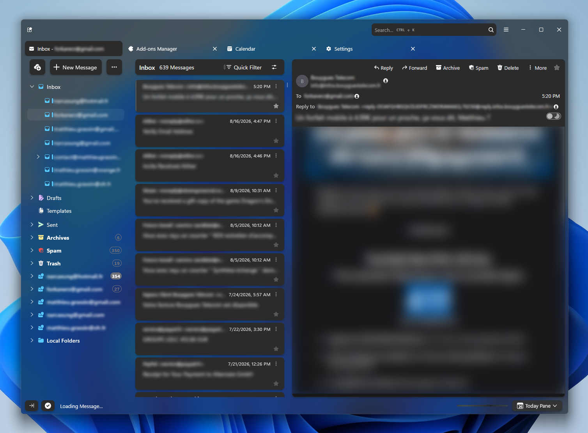
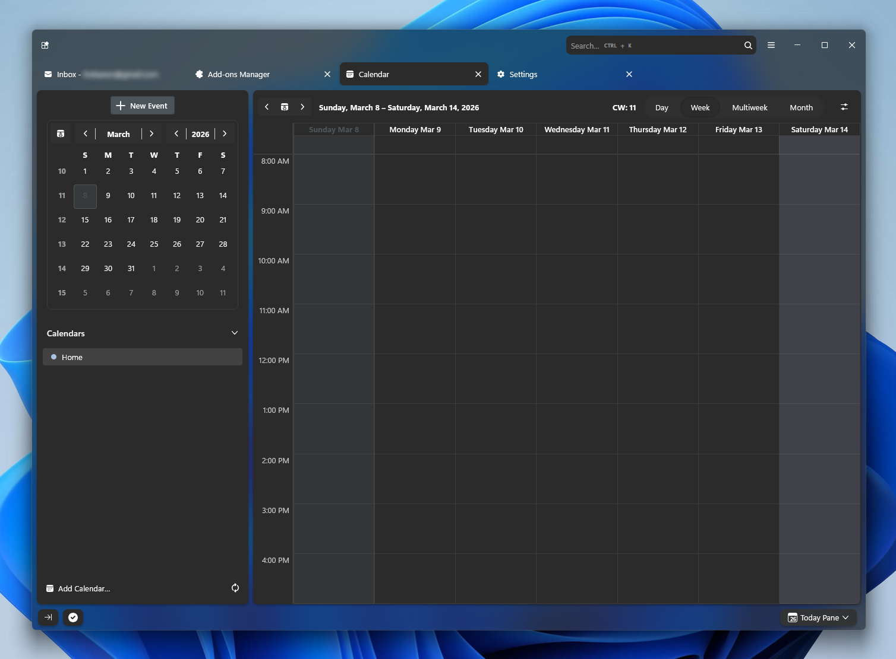
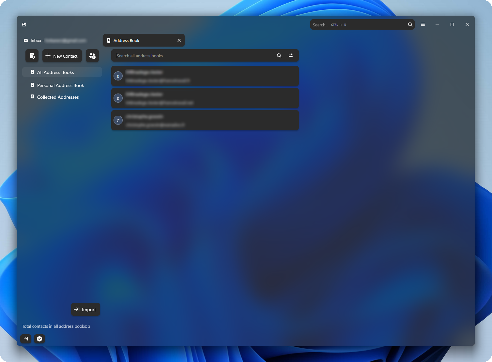
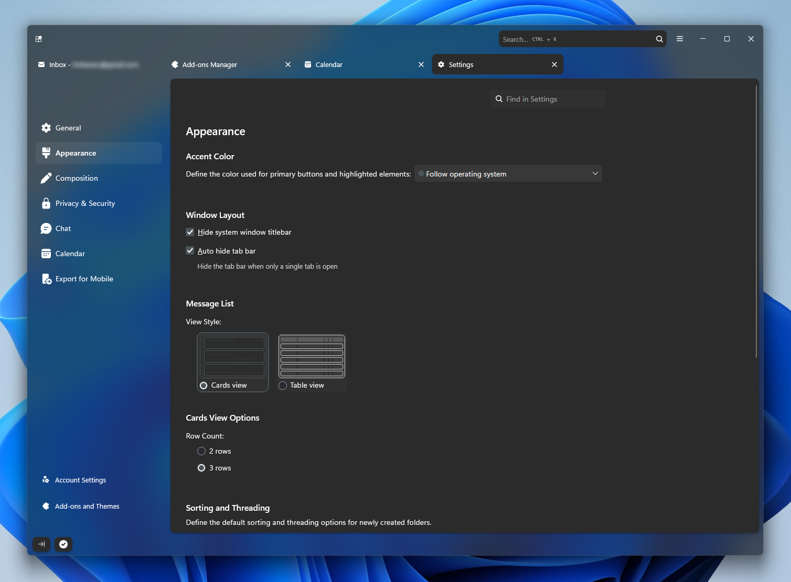
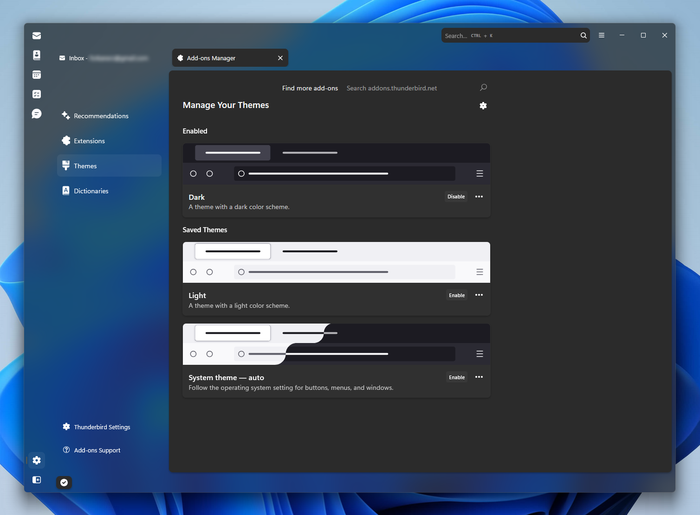
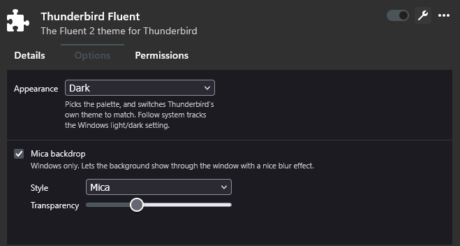

<h1 align="center">
	
     
	thunderbird-fluent
</h1>

A Fluent theme for Thunderbird.

 

	

## Features

- Reworked layout and appearance to match Microsoft Fluent 2's design system.
- Light, Dark, or follow system mode option.
- Toggleable mica background with transparency control.
- Brand new icons from [Microsoft's FluentUI Icons](https://github.com/microsoft/fluentui-system-icons).

   
Previews

   
    
   
    
   
    
   

## Install

**If you already have a `userChrome.css` or `userContent.css` of your own, back
them up before installing.**

### Extension

1. Download [`thunderbird-fluent.zip`](https://github.com/Narcasung/thunderbird-fluent/releases/latest/download/thunderbird-fluent.zip).
2. From Thunderbird's Add-ons Manager: gear icon > Install Add-on From File > select the downloaded zip.
3. Restart Thunderbird.

You can change the options in Add-ons Manager > Extensions > Thunderbird Fluent > Options tab.

The extension's theme mode option automatically switches Thunderbird's own setting as well as its own CSS files theme override. Don't change Thunderbird's theme manually or this theme will not work correctly.

### Manual install

1. Copy this repo's `chrome` folder into your Thunderbird's profile folder.\
   Windows path: `%USERPROFILE%\AppData\Roaming\Thunderbird\Profiles\<profile>`\
   To find the folder: Help > Troubleshooting Information > Profile Folder >
   Open Folder.
2. Change the `@import url("fluent-icons.css");` line in `userChrome.css`
   and `@import url("fluent-icons-content.css");` line in `userContent.css` to\
   `/*@import url("fluent-icons.css");*/` and `/*@import url("fluent-icons-content.css");*/` respectively.
3. In `about:config` (Settings > General > Config Editor), set
   `toolkit.legacyUserProfileCustomizations.stylesheets` to `true`.
4. Restart Thunderbird.

Not installing the extension comes with some inconvenience:

- No options page. Change the prefs yourself in `about:config` instead:

  | Pref                                         | Values                       |
  | -------------------------------------------- | ---------------------------- |
  | `extensions.thunderbird-fluent.colorScheme`  | `system`, `light` or `dark`  |
  | `widget.windows.mica`                        | `true` / `false`             |
  | `widget.windows.mica.toplevel-backdrop`      | `2` Mica, `3` Acrylic        |
  | `extensions.thunderbird-fluent.transparency` | `10` to `100`, in steps of 10 |

- If you want to remove the theme, delete `<profile>/chrome` and reset the prefs above by hand.

## Uninstall

1. Remove the extension from the Add-ons Manager and restart.

- Removing/disabling the extension should reset the touched prefs.\
  If you installed manually, or if you still notice undesired transparency after uninstalling the extension, reset them yourself.
- Removing/disabling the extension should delete the chrome files.\
  If you installed manually, or if you still notice theme leftovers after uninstalling the extension, check your profile\chrome folder manually for remaining files.
